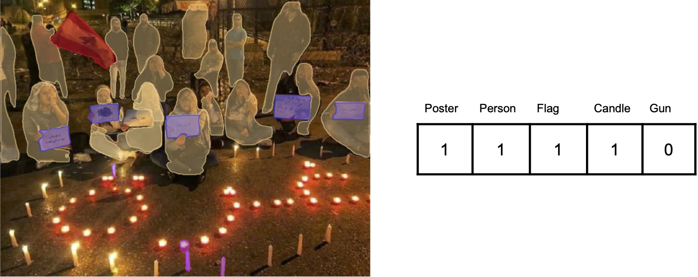

<div>
  <div align="center">
    
  </div>
  <div align="left">
    <h1>Protest Segments</h1>
    <p>
      Protest segments is a two-level classification method that detects the 
      segments present in images and aggregates them into feature vectors, which are 
      then used in the second level by a standard machine learning classifiers to 
      discriminate between images. It was introduced in the paper "Improving Computer 
      Vision Interpretability: Transparent Two-level Classification for Complex Scenes" 
      and released in this repository. 
    </p>
    <h4>
      <a target="_blank" href="https://doi.org/10.1017/pan.2024.18">Paper</a>
      <span> · </span>
      <a target="_blank" href="https://github.com/ciass-konstanz/protest-segments/">Code</a>
      <span> · </span>
      <a target="_blank" href="https://huggingface.co/spaces/ciass/protest-segments">Demo</a>
      <span> · </span>
      <a target="_blank" href="https://doi.org/10.7910/DVN/TFTEF2">Data</a>
    </h4>
  </div>
</div>

<!-- Getting Started -->
## Getting Started

### Demo

If you just want to try out our method with a couple of your images, we recommend you to
view [the demo](https://huggingface.co/spaces/ciass/protest-segments). The demo allows 
you to upload an image, define a vocabulary of objects, an aggregation, and returns 
the segmented image and the respective feature vector.

Even if you want to generate these vectors for a larger number of images, you don't have 
to go through the following installation on your personal computer. Instead, you can use 
the [demo via API](https://huggingface.co/spaces/ciass/protest-segments?view=api), for 
which you only need to install the Gradio client for Python and follow the below Python 
code snippet to obtain the vector for a sample image.

⚠️ If you want to use the same segmentation models as in the paper, then you have to 
duplicate this space in a [space environment with GPU accelerator](https://huggingface.co/spaces/ciass/protest-segments?duplicate=true).

1. Install the Gradio client for Python.

```bash
pip install gradio_client
```

2. Execute the below Python code snippet to obtain the feature vector for a sample image.

```python
from gradio_client import Client, file

client = Client("https://ciass-protest-segments.hf.space/")
result = client.predict(
		image=file("https://raw.githubusercontent.com/ciass-konstanz/protest-segments/main/docs/demo.jpg"),
		vocabulary="COCO",
		feature_aggregation="count",
		api_name="/predict"
)
print(result)
```

### Docker

To be able to segment images and generate feature vectors on your personal computer, the
fastest and most convenient way is to use the provided Docker image. It allows you to
install the necessary dependencies, regardless of the local operating system etc. 

1. Run the following command to build the Docker image.

```bash
docker image build -t protest-segments:latest .
```

2. After building the Docker image, you can start an interactive session inside the 
Docker container. Please mind that after closing the session you can't access it 
anymore.

```bash
docker exec -it protest-segments:latest bash
```

3. In the session inside the Docker container you can install the necessary dependencies
using the following command. 

```bash
source scripts/install.sh
```

Now you are ready to run the codes of the project, which you can all conveniently find 
in the current directory. For example, you can extract the segments from an image and 
create the feature vector (see demo image).

If you prefer to run the code directly on the host, you will have to follow the
prerequisites and installation steps below.

<!-- Prerequisites -->
### Prerequisites

- Python: You will need Python 3. We recommend you a recent version, like Python 
3.8.
- GCC: You will need compilers for gcc and g++, at least in version ≥ 5.4.
- (Optional) CUDA: Your personal computer should optionally have an Nvidia graphics 
card as well as a CUDA installation. The segmentation of images can also be 
calculated without it, but it is much slower and the available segmentation models are 
worse. To replicate the results in our paper, it is an inevitable prerequisite.

We ran the code on a server node with Ubuntu 22.04 installation, 8 Intel Xeon cores with 
2.50 GHz, 128 GB memory as well as an Nvidia graphics card, Quadro RTX 6000 with 24 GB 
memory.

<!-- Installation -->
### Installation

1. Clone the repository and its submodules and navigate into the directory. If you've 
already cloned the repository without the flag `--recurse-submodules`, please run the 
command `git submodule update --init --recursive`.

```bash
git clone https://github.com/ciass-konstanz/protest-segments --recurse-submodules
cd protest-segments
```

2. Create a virtual environment and activate it.

```bash
python3 -m venv env
source env/bin/activate
```

3. Install the Python package requirements. 

```bash
pip install -r requirements.txt
```

4. Install Detectron 2. If you run into issues, you can check the [installation steps](https://detectron2.readthedocs.io/en/latest/tutorials/install.html).

```bash
pip install -e modules/detectron2
```

5. (Optional) If you have an Nvidia graphics card as well as a CUDA installation, 
install MaskDINO. If you run into issues, you can check the [installation steps](https://github.com/IDEA-Research/MaskDINO/blob/main/INSTALL.md).

```bash
cd modules/MaskDINO
pip install -r requirements.txt
cd maskdino/modeling/pixel_decoder/ops
sh make.sh
cd ../../../../../../
```

6. (Optional) If you have an Nvidia graphics card as well as a CUDA installation, 
install Detic. If you run into issues, you can check the [installation steps](https://github.com/facebookresearch/Detic/blob/main/docs/INSTALL.md).

```bash
cd modules/Detic
pip install -r requirements.txt
cd third_party/Deformable-DETR/models/ops
sh make.sh
cd ../../../../../../
```

<!-- Demo Image -->
### Demo Image

The demo code `01_extract_segments_demo.py` creates the segments for an image. This 
code is for pedagogical purposes only, because it can only create the segments of a 
single image. To apply the demo segmentation to one demo image `docs/demo.jpg` with the
vocabulary `lvis` and feature aggregation `count`, you can execute the following 
command. This will save a segmented image `docs/demo_segments.jpg` and the feature 
vector `docs/demo_features.csv`.

If you want to use your graphics card, then you need to remove the flag `--cpu`. 

```bash
python3 01_extract_segments_demo.py \
  --image docs/demo.jpg \
  --vocabulary lvis \
  --feature-aggregation count \
  --image-segmented docs/demo_segments.jpg \
  --features docs/demo_features.csv \
  --cpu
```

For the different configurations the following segmentation models are used.

| GPU | Vocabulary | Segmentation Model                                                          | 
|-----|------------|-----------------------------------------------------------------------------|
| Yes | COCO       | [Li et al. (2022)](https://arxiv.org/abs/2206.02777)                        |
| Yes | LVIS v1    | [Zhou et al (2022)](https://arxiv.org/abs/2201.02605)                       |
| No  | COCO       | [Wu et al., 2017](https://github.com/facebookresearch/detectron2/tree/main) |
| No  | LVIS v0.5  | [Wu et al., 2017](https://github.com/facebookresearch/detectron2/tree/main) |

<!-- Data -->
## Data

You can download the data via [Dataverse](https://doi.org/10.7910/DVN/TFTEF2).

<!-- Images -->
### Images

The images we collected for our dataset have been annotated according to whether they 
show protest or not. More information on exactly how we collected and annotated the 
images can be found in the online appendix.

The following list gives an overview of all variables included in the dataset 
`data/images.csv`.

- `id`: The identifier is never the same for multiple images in the dataset, allowing to 
uniquely identify the image. Its name is id. Its type is a version 4 UUID. An example is 
0b7d7c4f-4413-4dbc-9f10-29cf6ea38d19. 

- `path`: The relative path where the image can be found from the root of the dataset. 
Its name is path. Its type is a string. 

- `location`: The country where the image was posted is used as the location of the 
image. The country is represented by its three-letter country code defined in ISO 
3166-1. Its name is location. Its type is a three-letter country code ISO 3166-1 
alpha-3.

- `date`: The date at which the image was posted is used as the date of the image. In 
order to get the local time in the respective location it must be converted with the 
respective offset from UTC. Its name is date. Its type is a datetime string in ISO 8601 
date format (YYYY-MM-DDThh:mm:ssZ).

- `split`: The data split in which the image is included. Its name is split. Its type is 
a string. For the training images this variables is train, while for the testing images 
it is test.

- `protest`: The protest category was annotated by a human coder based on the image. To 
get the category names they have to be translated from the category numbers. Its name is 
protest. Its type is an integer. Its values are 3: Protest (high confidence), 2: Protest 
(low confidence), 1: No protest (low confidence), and 0: No protest (high confidence).

<!-- Image Archive -->
### Image Archive

We unfortunately cannot make the images themselves publicly available. This is due to 
data protection and copyright reasons (see X's regulation of the use of their API). 
However, we will make the image archive available to colleagues in political and 
computer science upon request. The majority of the results of this project can also be 
generated with the segments (see segments), with the exception of the results of 
conventional computer vision methods. If you think that you still need the archive of 
images and are eligible for it, please write an email to the [corresponding author](mailto:stefan.scholz@uni-konstanz.de).

<!-- Segments -->
### Segments

The data that we can make publicly available are the segments that we have recognized on 
the images from our data set. We recognized these segments using the Python script 
`02_extract_segments.py`. We recognized the COCO segments with the [configuration](https://github.com/IDEA-Research/MaskDINO/blob/main/configs/coco/instance-segmentation/swin/maskdino_R50_bs16_50ep_4s_dowsample1_2048.yaml) 
and [weights]((https://github.com/IDEA-Research/detrex-storage/releases/download/maskdino-v0.1.0/maskdino_swinl_50ep_300q_hid2048_3sd1_instance_maskenhanced_mask52.3ap_box59.0ap.pth)) 
of [Li et al. (2023)](https://arxiv.org/abs/2206.02777). We recognized the LVIS segments 
using the [configuration](https://github.com/facebookresearch/Detic/blob/main/configs/Detic_LCOCOI21k_CLIP_SwinB_896b32_4x_ft4x_max-size.yaml) 
and [weights](https://dl.fbaipublicfiles.com/detic/Detic_LCOCOI21k_CLIP_SwinB_896b32_4x_ft4x_max-size.pth) 
of [Zhou et al. (2022)](https://arxiv.org/abs/2201.02605).

The following lists the variables included in the datasets `data/segments_coco.csv` and 
`data/segments_lvis.csv`.

- `id`: The image identifier in the dataset. Its name is id. Its type is a version 4 
UUID. An example is 0b7d7c4f-4413-4dbc-9f10-29cf6ea38d19. 

- `seg_num`: The number of the segment category, as it is given by the module 
detectron2. Its type is an integer. An example is 0 (for person in COCO). 

- `seg_name`: The name of the segment category in lowercase, as it is given by the 
module detectron2. Its type is a string. An example is person.

- `seg_score`: The confidence score of the detected segments, as it is given by the 
segmenter. Its type is a float.

- `seg_prop`: The proportion of the image that is covered by the segment. Its type is a 
float. An example is 0.1 (for a segment that covers 10% of the image).

<!-- Predictions -->
### Predictions

We also make the predictions of all models available. These predictions contain for each 
model and each image a prediction whether it is a protest image. An overview of all 
models and their predictions can be found in the file `data/models.csv`.

The file name of the predictions with our segment models always starts with the prefix 
predictions_seg, followed by the confidence level, the classification method, the 
vocabulary and the feature. For example, the predictions of the model with the 
confidence level low, the classification method xgboost, the vocabulary lvis and the 
feature area sum can be found in the file `data/predictions_seg_low_xgboost_lvis_area_sum.csv`.

The file name of the predictions of the traditional computer vision models is composed 
of the prefix predictions, the architecture and the confidence level. For example, the 
predictions of the model with the vision transformer and the confidence level low are 
located in the file `data/predictions_vit_low.csv`.

<!-- Model Weights -->
## Model Weights

We also make the model weights of all our models available via [Dataverse]().

These model weights can be used on our data, but possibly also on other data for which 
protest should be predicted. An overview of all models and their model weights can be 
found in the file `data/models.csv`.

The model weights of the segment models are named after the confidence level, the 
classification method, the vocabulary and the feature. Thus, the weights of the model 
with the confidence level `low`, the classification method `xgboost`, the vocabulary 
`lvis` and the feature `area_sum` are called `models/seg_low_xgboost_lvis_area_sum.pth`. 

The model weight of traditional computer vision models is composed of the architecture 
and the confidence level. For example, the weights of the vision transformer `vit` with
confidence `low` are called `models/vit_low.pth`.

<!-- Results -->
## Results

Before you can replicate the results, please check the prerequisities (see 
prerequisities), follow the Docker setup (see Docker) or the local installation steps 
(see installation), download the data into the folder `data` (see data) and the model 
weights into the folder `models` (see models).

<!-- Extract Segments -->
### Extract segments

The code `02_extract_segments.py` creates the segments from our image dataset. To 
execute this code, however, you need a graphics card. In addition, you also need the 
image archive of our dataset, which we cannot provide here. It can only be made 
available on request (see image archive). But even without the image archive you can 
execute the code `03_train_models_segments.py`, `05_predict_models.py`, 
`06_eval_models.py`, `07_eval_importances.py`, `08_eval_dataset.py` and 
`10_eval_temporal.py`.

To segment our image dataset with the COCO vocabulary, you can execute the following 
command. This will save the created segments `data/segments_coco.csv` [~17 hours].

```bash
python3 02_extract_segments.py \
  --images data/images.csv \
  --images-archive data/images.tar \
  --segments data/segments_coco.csv \
  --vocabulary coco
```

By executing the following command, the same will be done for our image dataset with the 
LVIS vocabulary. This will save the created segments `data/segments_lvis.csv` [~5 
hours].

```bash
python3 02_extract_segments.py \
  --images data/images.csv \
  --images-archive data/images.tar \
  --segments data/segments_lvis.csv \
  --vocabulary lvis
```

<!-- Train Models Segments -->
### Train Models Segments

The code `03_train_models_segments.py` trains all models that use our two-stage 
classification approach. 

To train the models you can execute the following command. This will save the weights of 
the models in the folder `models` [~4 days].

```bash
python3 03_train_models_segments.py \
  --images data/images.csv \
  --segments-coco data/segments_coco.csv \
  --segments-lvis data/segments_lvis.csv \
  --models models/
```

<!-- Train Models Conventional -->
### Train Models Conventional

The code `04_train_models_conventional.py` trains all the conventional computer vision 
models on our dataset. To execute this code, however, you need a graphics card. In 
addition, you also need the image archive of our dataset, which we cannot provide here. 
It can only be made available on request (see image archive). But even without the image 
archive you can execute `05_predict_models.py`, `06_eval_models.py`, 
`07_eval_importances.py`, `08_eval_dataset.py` and `10_eval_temporal.py`.

To train the models you can execute the following command. This will save the weights of 
the models in the folder `models` [~19 days].

```bash
python3 04_train_models_conventional.py \
  --images data/images.csv \
  --images-archive data/images.tar \
  --models models/
```

<!-- Predict Models -->
### Predict Models

The code `05_predict_models.py` uses all models to predict whether the images are 
protest images. 

To make the predictions with our two-stage approach only, you can execute the following 
command. This saves the predictions in the folder `data` [~25 minutes].

```bash
python3 05_predict_models.py \
  --images data/images.csv \
  --segments-coco data/segments_coco.csv \
  --segments-lvis data/segments_lvis.csv \
  --models models/ \
  --predictions data/
```

To make predictions using both our two-stage approach and the conventional approaches, 
you can execute the following command. This requires to have the image archive of our 
dataset as well as the [model weights](https://www.dropbox.com/s/rxslj6x01otf62i/model_best.pth.tar?dl=0) 
for the ResNet50 from [Won et al. (2017)](https://arxiv.org/abs/1709.06204). The model 
weights must be saved as file `resnet.pth` inside the folder `models`. This saves the 
predictions in the folder `data` [~90 minutes].

```bash
python3 05_predict_models.py \
  --images data/images.csv \
  --images-archive data/images.tar \
  --segments-coco data/segments_coco.csv \
  --segments-lvis data/segments_lvis.csv \
  --models models/ \
  --predictions data/ \
  --with-conventional
```

<!-- Evaluate Models -->
### Evaluate Models

The code `06_eval_models.py` evaluates the predictions of all models. 

To evaluate the predictions, you can execute the following command. This will save the 
figure `figures/figure_4.pdf`, table `tables/table_a3.tex`, table `tables/table_a4.tex`
and table `tables/table_a6.tex` [~20 seconds].

```bash
python3 06_eval_models.py \
  --images data/images.csv \
  --models data/models.csv \
  --predictions data/ \
  --tables tables/ \
  --figures figures/
```

<!-- Evaluate Importances -->
### Evaluate Importances

The code `07_eval_importances.py` evaluates the importances of two of our two-stage 
models. For the main article, the model that is evaluated uses the confidence low, 
classification method gradient-boosted tree and feature area sum. For the online 
appendix the same model is evaluated but using the confidence high.

To evaluate the importances, you can execute the following command. This will save the 
importances `data/features_seg_low_xgboost_lvis_area_sum.csv`, importances 
`data/features_seg_high_xgboost_lvis_area_sum.csv`, figure `figures/figure_5.pdf`, 
figure `figures/figure_6_1.pdf`, figure `figures/figure_6_2.pdf`, figure 
`figures/figure_6_3.pdf`, figure `figures/figure_a2.pdf` and figure 
`figures/figure_a3.pdf` [~23 hours].

```bash
python3 07_eval_importances.py \
  --images data/images.csv \
  --segments-lvis data/segments_lvis.csv \
  --models models/ \
  --features data/ \
  --figures figures/
```

<!-- Evaluate Dataset -->
### Evaluate Dataset

The code `08_eval_dataset.py` evaluates the image dataset. 

To evaluate the dataset, you can execute the following command. This will save the table 
`tables/table_a2.tex` [~2 seconds].

```bash
python3 08_eval_dataset.py \
  --images data/images.csv \
  --tables tables/
```

<!-- Evaluate Clusters -->
### Evaluate Clusters

The code `09_eval_clusters.py` evaluates the images by clustering them, analyzing the 
performance within these clusters and visualizing the images within these clusters. 

To evaluate the clusters, you can execute the following command. This requires to have 
the image archive of our dataset. This will save the embeddings `data/embeddings.csv`, 
clusters `data/clusters.csv`, table `tables/table_a5.tex` and figure 
`tables/figure_a1.pdf` [~2 hours].

```bash
python3 09_eval_clusters.py \
  --images data/images.csv \
  --images-archive data/images.tar \
  --models models/ \
  --predictions data/ \
  --embeddings data/ \
  --clusters data/ \
  --tables tables/ \
  --figures figures/ 
```

<!-- Evaluate Temporal Trends -->
### Evaluate Temporal Trends

The code `10_eval_temporal.py` evaluates the temporal trends of the most frequent 
segments on the protest images.

To evaluate the temporal trends, you can execute the following command. This will save 
the figure `figures/figure_a4.pdf` [~10 seconds].

```bash
python3 10_eval_temporal.py \
  --images data/images.csv \
  --segments-lvis data/segments_lvis.csv \
  --figures figures/ 
```

<!-- License -->
## License

The project's code is distributed under the [Apache 2.0 License](https://www.apache.org/licenses/LICENSE-2.0), 
while its data and model weights are distributed under the [CC-BY-4.0 License](http://creativecommons.org/licenses/by/4.0).

<!-- Citation -->
## Citation

If you find this project and its materials useful, please cite our paper. 

```
@article{
    scholz2025improving,
    title={Improving Computer Vision Interpretability: Transparent Two-Level Classification for Complex Scenes},
    volume={33}, 
    DOI={10.1017/pan.2024.18}, 
    number={2}, 
    journal={Political Analysis}, 
    author={Scholz, Stefan and Weidmann, Nils B. and Steinert-Threlkeld, Zachary C. and Keremoğlu, Eda and Goldlücke, Bastian}, 
    year={2025}, 
    pages={107–121}
}
```
